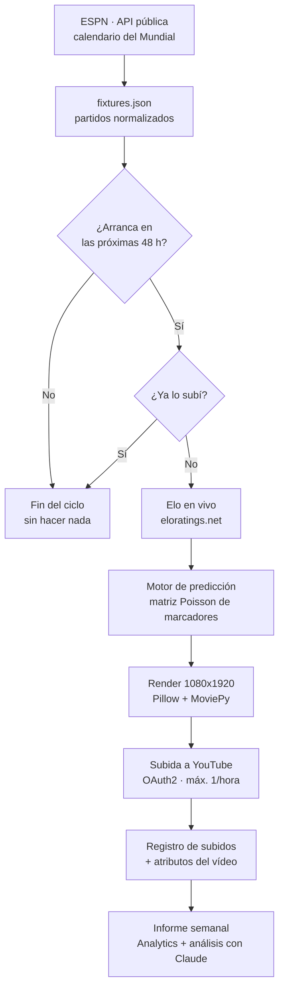

# Cómo está hecho — World Cup AI Shorts

> Un canal de YouTube que predijo partidos del Mundial 2026 durante un mes entero
> sin que nadie tocara un botón. Ni editor de vídeo, ni plantillas, ni becario.

*Versión web maquetada para compartir: **<https://danigmillan-cmd.github.io/worldcup-ai-shorts/>** — un único fichero ([`docs/index.html`](docs/index.html)), sin dependencias, que también se abre en local haciendo doble clic.*

| 98 | 0 | 3 | 6.800 | 20.000 |
|---|---|---|---|---|
| Shorts publicados | Ediciones manuales | Formatos de vídeo | Líneas de Python | Simulaciones por ranking |

---

## 1. La idea en una frase

Cada vez que se acerca un partido del Mundial, el sistema se entera solo, calcula quién va a
ganar, dibuja un vídeo vertical de seis segundos con las banderas y las probabilidades, y lo
sube a YouTube. Después mide cómo ha funcionado y escribe su propio informe.

No hay nada grabado, nada renderizado a mano y ningún servicio de pago generando el vídeo.
Cada fotograma se dibuja píxel a píxel con **Pillow**, se monta en una línea de tiempo con
**MoviePy** y se publica con la API de YouTube. Todo corre en **GitHub Actions**, así que ni
siquiera hace falta tener el ordenador encendido.

> **La regla que sostiene el diseño:** cada capa ignora a las demás. El módulo que busca
> partidos no sabe que existe el vídeo. El que dibuja no sabe que existe YouTube. Cambiar la
> fuente de datos no obliga a tocar el renderizador — por eso el mismo código sirve de
> plantilla para otro deporte o para otra competición.

---

## 2. El recorrido de un vídeo

Cinco etapas, siempre las mismas, siempre en este orden. Cada una escribe su resultado en un
fichero y la siguiente lo lee — así cualquier paso se puede relanzar por separado.



El rombo **«¿Ya lo subí?»** es la pieza más importante de todo el sistema. El ciclo se ejecuta
tres veces por hora, todos los días: sin ese registro, el mismo partido se publicaría cuarenta
veces. Con él, repetir la ejecución no cuesta nada y no rompe nada.

---

## 3. El cerebro: de Elo a marcador

Las predicciones no salen de una IA generativa ni de una tabla inventada. Salen de un modelo
estadístico clásico, el mismo que usan las casas de apuestas, con dos pasos.

### Paso 1 — Cuántos goles espera marcar cada equipo

Se toma el Elo real de ambas selecciones (rating que se descarga en vivo). La diferencia de Elo
se reparte en goles esperados alrededor de un total base de `2.4` goles por partido. A las tres
anfitrionas — Estados Unidos, México y Canadá — se les suman `75` puntos de Elo por jugar en casa.

### Paso 2 — La matriz de marcadores

Con esos goles esperados se construye una rejilla de Poisson: la probabilidad de **cada marcador
posible**, de 0-0 a 8-8. Ochenta y una casillas. Sumando las de un lado sale «gana A», las de la
diagonal «empate», y la casilla más alta es el resultado que se muestra en pantalla.

```
              GOLES DEL VISITANTE
              0      1      2      3      4
        0    4.1    4.5    2.5    0.9    0.2
        1    7.4  [ 8.1 ]  4.4    1.6    0.4     ← marcador más probable: 1-1
LOCAL   2    6.6    7.2    4.0    1.5    0.4
        3    3.9    4.3    2.4    0.9    0.2
        4    1.7    1.9    1.0    0.4    0.1

        Debajo de la diagonal = gana el local
        La diagonal            = empate
        Encima de la diagonal  = gana el visitante
```

Si la casilla más alta cae en la diagonal, el vídeo muestra **EMPATE** con las dos banderas en
vez de forzar un ganador. Ese detalle salió de ver los primeros vídeos: enseñar un «ganador» en
un partido que el propio modelo veía 50-50 quedaba falso. Ahora el empate, el marcador y las
barras salen todos de la *misma* matriz, así que nunca se contradicen.

### Y el mismo motor sirve para todo

- **Un partido** — se lee la matriz directamente.
- **Un grupo** — se juegan los seis partidos al azar 800 veces y se cuenta cuántas veces queda
  cada equipo entre los dos primeros.
- **El torneo entero** — 10.000 mundiales completos, de la fase de grupos a la final, para sacar
  la probabilidad real de levantar la copa.

Con Elo puro, el favorito salía con un 40 % de ganar el Mundial: absurdo. Se comprimen los
ratings hacia la media del torneo (factor `0.5`), lo que mantiene el orden de favoritos pero baja
al campeón a un realista **15-22 %**.

---

## 4. Los tres formatos

Vertical 1080×1920, 30 fps, estética de retransmisión deportiva en cian sobre fondo oscuro. Los
tres comparten primitivas de dibujo, así que añadir un cuarto formato es escribir un
renderizador, no reinventar nada.

| Formato | Duración | Qué muestra |
|---|---|---|
| **Predicción de partido** | 5,5 s · 98 publicados | Dos banderas, dos barras de probabilidad llenándose, revelado del ganador y el marcador. Se genera solo 48 h antes del partido. |
| **Power Ranking** | ~30 s | Cuenta atrás del top 10 por probabilidad real de ganar la copa. Oro, plata y bronce para el podio y sello de fecha de actualización. |
| **Odds de clasificación** | 7,5 s | Tabla del grupo apareciendo fila a fila y barra de probabilidad de pasar de ronda, en verde, ámbar o rojo. |

---

## 5. Dibujar un vídeo sin editor

No hay After Effects ni plantillas compradas. Hay una función que, dado un instante del vídeo,
devuelve la imagen exacta de ese instante — y MoviePy la llama treinta veces por segundo. Todo lo
demás es dibujar bien.

- **Zona segura** — el contenido vive entre los píxeles 62 y 1016 de ancho, y los últimos 200 de
  alto quedan libres para los botones de la app.
- **Curvas de animación** — nada se mueve en línea recta: las barras frenan al llegar
  (`ease_out`) y las banderas entran con un rebote (`ease_overshoot`).
- **Banderas** — se descargan una vez de flagcdn y se guardan en caché.
- **Sonido** — si no hay música, se sintetizan los efectos por código. El vídeo nunca falla por
  un asset que no está.
- **Marcador «de espectáculo»** — el resultado en pantalla se muestrea de una matriz más
  ofensiva que la calibrada, pero obligado a coincidir con el ganador ya decidido. Queda más
  vistoso sin tocar ni una probabilidad.

---

## 6. Que no haya que estar delante

Empezó como una tarea programada en el PC. Duró poco: si el portátil estaba apagado, dormido o
sin batería, el partido pasaba sin vídeo. Ahora el ciclo vive en GitHub Actions y se dispara
**a los minutos 5, 25 y 45** de cada hora.

| Riesgo | Qué hace el sistema |
|---|---|
| Cron perdido | GitHub se salta ejecuciones a menudo, así que dispara tres veces por hora. Las de más son inofensivas: no repiten trabajo. |
| Doble subida | Un registro en disco marca cada partido como subido. Solo `uploaded: true` bloquea; un render de prueba se reintenta. |
| Dos ciclos a la vez | Grupo de concurrencia en el workflow: se hace cola, nunca se cancela una subida en curso. |
| Ráfaga de vídeos | Máximo un Short por hora, para no parecer spam en el feed. |
| Caída de la API | Si falla el calendario, se conserva el anterior. Si falla el login de YouTube, se renderiza igual y se sube al ciclo siguiente. |
| Un partido roto | La excepción se captura dentro del bucle: un partido malo nunca tumba a los demás. |
| Nombres que no cuadran | ESPN dice «Korea Republic» y «USA»; el resto del sistema usa otros nombres. Una capa de alias los unifica. |

> Todo el manejo de tiempo es **UTC de principio a fin**. La hora local solo aparece en las
> cabeceras de los logs. Un desfase de dos horas en un sistema que decide «¿este partido empieza
> pronto?» es un fallo silencioso muy caro.

---

## 7. El canal se analiza a sí mismo

Cada semana el sistema descarga sus propias métricas de YouTube Analytics — visualizaciones,
retención, de dónde llega la gente — y las cruza con lo que guardó en el momento de subir cada
vídeo: qué plantilla de título usó, a qué hora publicó, cuánto duraba, qué selecciones aparecían
y cómo de fuertes eran.

Con eso escribe un informe en Markdown. La parte interesante es el final: los datos se le pasan a
**Claude** por línea de comandos, con el papel de analista de crecimiento, y devuelve diagnóstico,
hipótesis y **un** experimento para la semana siguiente. Si la muestra todavía es pequeña, cambia
de prompt y se limita a describir lo que ve, sin sacar conclusiones.

- Va por la suscripción de Claude Code, no por API de pago.
- Si Claude no está disponible, el informe se genera igual solo con las reglas heurísticas.

---

## 8. Lo que de verdad se aprende

**Repetir debe ser gratis.** Un proceso automático que no se puede relanzar sin miedo no está
terminado. La clave está en registrar lo irreversible — aquí, la subida — no lo barato.

**Que nada se contradiga.** Hubo dos modelos distintos para partido y para grupo, y daban
resultados incoherentes entre sí. Unificarlos en una sola matriz arregló el problema de raíz.

**Fallar hacia el lado bueno.** Cada fallo posible tiene una salida peor pero válida: datos de
ayer, modo sin subida, informe sin IA. El calendario nunca se rompe entero.

**Poder cambiar de deporte.** Un único módulo habla con la fuente de datos. Cambiarlo por otra
liga u otro deporte no obliga a tocar ni el render ni la subida.

---

El Mundial ha terminado y el canal cierra con **98 Shorts publicados**, ninguno editado a mano.
El código queda como plantilla: cambiando la fuente de datos y los fondos, el mismo sistema sirve
para la próxima competición.

`Python · Pillow · MoviePy · GitHub Actions · YouTube Data API · YouTube Analytics API`
